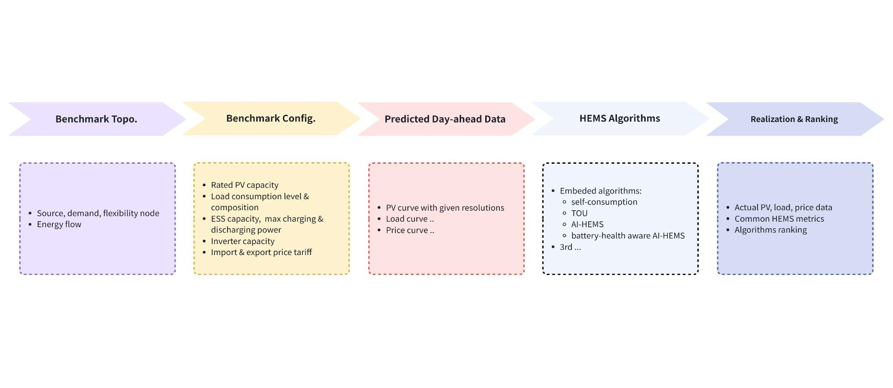

# Smart HEMS Benchmark

**Last Updated:** 2026-07-01

## Table of Contents

- [Basic Info](#basic-info)
- [Description](#description)
- [Overview](#overview)
- [Technical Profile](#technical-profile)
- [Grid Context](#grid-context)
- [Related Projects](#related-projects)
- [Maturity & Adoption](#maturity--adoption)
- [Learn More](#learn-more)
- [Additional Notes](#additional-notes)

## Basic Info

- LF Energy webpage:
- Website:
- Code: https://github.com/ecoflow-ai/smart-hems-benchmark
- Documentation:
- Calendar:
- LinkedIn:
- Community:
	- Mailing List:
	- Slack:
- LFX Insights:
- Other:

<!-- The repository currently sits under EcoFlow's GitHub org and is expected to move to a neutral org after the LF Energy transfer. Community infrastructure (website, mailing list, Slack) was not yet established as of mid-2026. -->

## Description

Manufacturer-neutral platform for benchmarking home energy management systems (HEMS) and the distributed energy resource (DER) investments they manage.

## Overview

Smart HEMS Benchmark provides shared datasets, standardized scenarios, common metrics, and reference algorithms for evaluating residential DER systems and the home energy management systems (HEMS) that control them. It models DER decision-making as an optimization problem across three phases of the asset lifecycle: **Location & Sizing** (where to install and how large to size PV and storage, over a roughly 15-year investment horizon), **HEMS dispatch** (a single household's day-ahead charge/discharge and self-consumption decisions), and **Grid Support** (residential DER participating in virtual power plants). Each phase has distinct decision variables, objectives, and time horizons, and the platform scores candidate system designs and control algorithms against a common set of economic, comfort, and battery-degradation metrics.

As households adopt rooftop PV and battery storage at accelerating rates, decisions about DER siting, sizing, home energy management, and grid support increasingly determine how much value these systems deliver. Today those decisions are evaluated with proprietary datasets, ad-hoc scenarios, and vendor-specific tools, so published results diverge and are difficult to trust or reproduce. By fixing the datasets, scenarios, and scoring metrics, Smart HEMS Benchmark lets any control approach — rule-based, model-predictive, or AI-driven — and any system configuration be compared on equal footing, reducing market fragmentation and giving buyers, researchers, and grid operators a common yardstick.

The platform is aimed at vendors benchmarking their controllers, researchers reproducing and comparing published methods, utilities and VPP operators assessing residential flexibility, and end users comparing HEMS offerings. It brings together three independent lines of work — at EcoFlow (China), the CoSES laboratory at the Technical University of Munich (Europe), and Stanford University (United States) — around a shared vision for open, reproducible benchmarking, presented publicly at the 2025 LF Energy Europe Summit. It is being contributed to LF Energy under neutral, multi-stakeholder governance so that no single company controls the roadmap.

*The five-stage benchmarking pipeline: topology, configuration, day-ahead predicted data, HEMS algorithms, and ranking & analysis.*

## Technical Profile

### What It Does

Simulates and scores residential DER system designs and HEMS control algorithms against shared datasets and standardized scenarios, producing multi-metric rankings across the DER lifecycle from siting and sizing through daily dispatch to virtual-power-plant participation.

### Problem(s) Solved

- **No standardized scenarios** for evaluating HEMS algorithms and system sizing, so results from different studies and vendors cannot be compared.
- **Proprietary datasets** that block fair, transparent comparison between competing controllers and system configurations.
- **Limited systematic evaluation** of how residential DER performs when participating in grid services and energy markets.

### Key Capabilities

- **Benchmark topology** — a description language linking system nodes (PV, ESS, load, EV, grid import/export) and their energy flows to HEMS constraints
- **Benchmark configuration** — rated PV capacity, load consumption level and composition, ESS capacity and maximum charge/discharge power, inverter capacity, and import/export tariffs
- **Day-ahead predicted data** — PV generation, load, and price curves at configurable time resolution, with uncertainty modeling
- **HEMS algorithm library** — baseline controllers (Grid-only, Grid+PV, Self-consumption) and advanced controllers (AI-driven time-of-use optimization, battery-health-aware dispatch, model predictive control), with support for adding third-party algorithms
- **Realization & ranking** — actual PV/load/price data, common HEMS metrics, sensitivity analysis (PV capacity, ESS capacity, load level, grid export limit), and multi-metric ranking across cost and revenue, comfort, battery degradation, and levelized cost of energy (LCOE)
- **Multi-market, multi-policy scenarios** — U.S. county-level analysis (built on open datasets such as ResStock), plus Germany and the UK, across fixed, time-of-use, and dynamic tariffs and regulatory regimes (non-export, net metering, net billing)

### Relevant Standards

None. Smart HEMS Benchmark is an evaluation and benchmarking platform; it does not implement grid communication or data model standards.

## Grid Context

### Grid Segment

Behind-the-meter

### Function

Planning & Analysis

<!-- Borderline vs. CityLearn. CityLearn is placed in Operations + Research because its content IS a control environment (a Gymnasium step-based control loop). Smart HEMS Benchmark is placed in Planning & Analysis because its defining activity is evaluation and ranking — it produces comparative insight (metrics, sensitivity analyses, multi-metric rankings) that humans consume to inform decisions (system sizing, algorithm selection, VPP feasibility), and it does not act on real-time grid state. It also includes an explicit 1–15 year siting/sizing phase that is squarely P&A and has no CityLearn analog. The HEMS-dispatch phase has an operational-control character (secondary), but the platform as a whole is a benchmark, not a control environment. Research intent captured as a cross-cutting tag. See taxonomy.md. -->

### Industry Solution Categories

#### Solution Type

- DER & HEMS Benchmarking Platform: Provides a standardized, reproducible environment for evaluating and comparing residential DER system designs and HEMS control algorithms across the asset lifecycle.

#### Component of

None. Smart HEMS Benchmark is a standalone evaluation and benchmarking platform, not a component of a broader operational system. Algorithms and system designs validated in it could inform HEMS products, DERMS, or planning tools, but the benchmark itself is not such a component.

### Cross-Cutting Tags

- **Project Intent:** Research
- **AI/ML:** No
- **Deliverable Type:** Software

## Related Projects

- **CityLearn**: Closest analog — both are behind-the-meter research environments for benchmarking demand-side control strategies. They differ in scope: CityLearn is a Gymnasium control environment for coordinating storage and heating/cooling across a district of buildings, evaluated mainly on cost, comfort, emissions, and grid-impact KPIs; Smart HEMS Benchmark centers on single-home and community DER economics across the full lifecycle (siting/sizing, daily HEMS dispatch, and VPP participation), with explicit tariff and regulatory scenarios and economic ranking (revenue, battery degradation, LCOE). Both are research-intent and do not currently integrate.
- **FlexMeasures**: Complementary across the research/applied boundary — FlexMeasures is a production energy management system that computes real dispatch schedules for customer-sited assets via a REST API, while Smart HEMS Benchmark evaluates and ranks the control algorithms themselves. Controllers validated in the benchmark could inform applied schedulers like FlexMeasures. The TAC proposal explicitly identifies FlexMeasures as a synergy target.
- **OpenSynth**: Complementary data source — OpenSynth's synthetic smart-meter datasets could supply prototypical household load profiles for benchmark scenarios, alongside the open datasets (e.g., ResStock) the platform already uses. Both are research-intent projects serving the modeling and ML community.

## Maturity & Adoption

### LF Energy Stage

Sandbox

<!-- The new-project proposal (TAC issue #669) was approved by the TAC via LFX. New projects enter LF Energy at the Sandbox stage. -->

### Deployment Maturity

R&D

<!-- Pre-production. As of mid-2026 the public repository contains project framing, preliminary results, and architecture diagrams but not the platform code; the open-source code launch is planned for late 2026. -->

### Supporting / Adopting Organizations

- EcoFlow (primary initiator and core development team)
- Technical University of Munich — CoSES Laboratory (power-hardware-in-the-loop, or PHIL, validation of multi-energy systems)
- Stanford University (feasibility assessment of PV and storage systems across the United States)

## Learn More

- [LF Energy Smart HEMS-Benchmark (TAC presentation)](https://github.com/lf-energy/tac/blob/main/meetings/2026/2026-06-09/LF-Energy%20Smart%20HEMS-BenchMark.pdf)
	- Date: 2026-06-09
	- Type: Presentation
- [LF Energy BenchMark Talk (LF Energy Europe Summit 2025)](https://static.sched.com/hosted_files/lfenergysummiteu2025/00/LF-Energy%20BenchMark%20Talk-V3.5-FinalUpload.pdf)
	- Date: 2025-09-11
	- Type: Presentation

## Additional Notes

Smart HEMS Benchmark is being contributed to LF Energy specifically to place it under neutral, multi-stakeholder governance — the point is that no single vendor controls the datasets, scenarios, or scoring that the ecosystem uses to compare products. Its value to utilities and DSOs is indirect but strategic: a trusted, manufacturer-neutral yardstick for residential DER performance and flexibility, which in turn supports fairer procurement and more credible estimates of grid-edge flexibility.

The project brings together three independent research threads across three continents (EcoFlow in China, TU Munich's CoSES lab in Europe, and Stanford in the United States), spanning complementary phases of the residential DER lifecycle. Planned integrations include HEMS Finder (a directory of 100+ HEMS service providers) and open platforms such as OpenEMS.

The code is released under the Apache-2.0 license. As of mid-2026 the repository sits under EcoFlow's GitHub org (`ecoflow-ai/smart-hems-benchmark`) and is expected to move to a neutral organization as part of the LF Energy transfer.